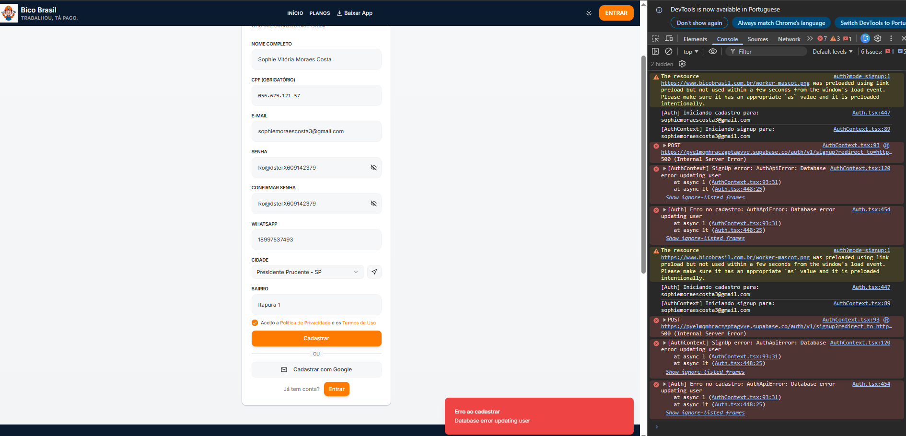

# 🚀 TRIGGER DE DEPLOY - VALIDAÇÃO CORRIGIDA

## Link:
https://github.com/GerenciaDriver/bico-brasil/edit/main/README.md

## Adicione:
```
<!-- Deploy Validation Fix 12:48 -->
```

## Commit:
```

```

---

**Após deploy (~2min), vou testar automaticamente!**
