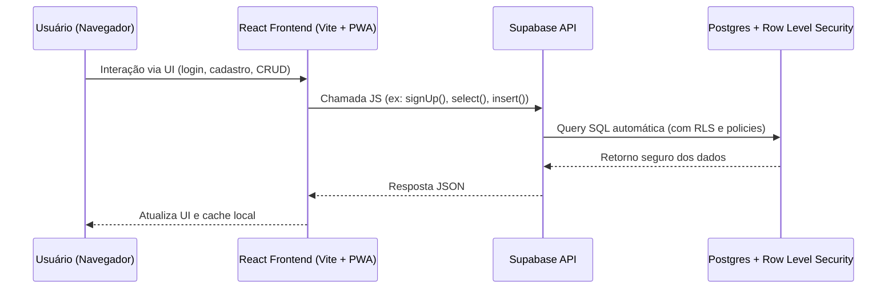
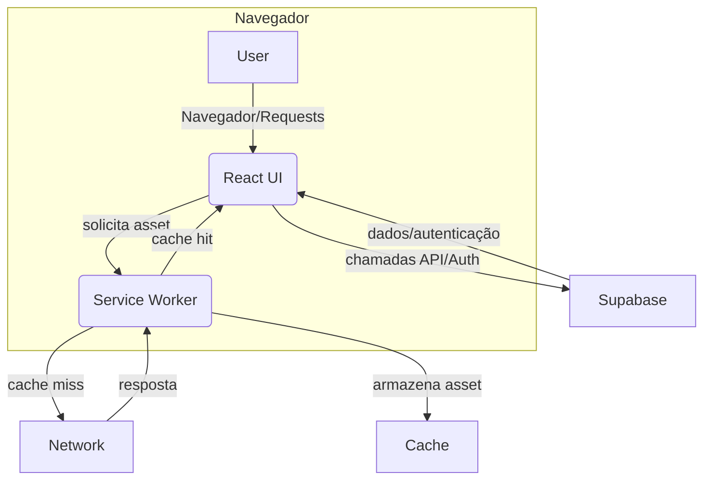

# Arquitetura do Bico Brasil Oficial

## Stack Tecnológica

- **Frontend**: React 18.x, gerenciamento de estado via Context API, com build/transpile utilizando Vite.
- **Backend (BaaS)**: Supabase (PostgreSQL, Auth, Storage, Realtime e Functions), acessível diretamente do frontend via supabase-js.
- **Deployment**: Aplicação como PWA (Progressive Web App), incluindo Service Worker customizado (`public/sw.js`) para suporte offline.

---

## Fluxo de Dados

A comunicação entre frontend e backend é feita **diretamente pelo cliente** utilizando a biblioteca [`@supabase/supabase-js`](https://supabase.com/docs/reference/javascript), encapsulada por um contexto React (`src/contexts/AuthContext.tsx`).



Fluxos principais:
- Todas as queries/auth passam pelo provider do contexto.
- As respostas do Supabase já respeitam as políticas de segurança de dados.
- O disparo de triggers no banco (ex: pós-cadastro) ocorre de forma transparente ao cliente.

---

## Estrutura Multi-tenant

Com a introdução de multi-tenancy, as tabelas **profiles** (usuários), **jobs** (`job_postings`) e **worker_services** agora possuem a coluna `tenant_id`:

```sql
tenant_id UUID DEFAULT '00000000-0000-0000-0000-000000000000'
```

**Isolamento entre clientes**:
- O campo `tenant_id` permite segregar dados por organização ou cliente.
- O acesso SQL é controlado por **Row Level Security (RLS)**, garantindo que cada tenant só vê seus próprios registros.
- O backend pode ser expandido para usar policies como: `USING (tenant_id = current_setting('app.tenant_id')::uuid)` (customizável conforme a plataforma evoluir).

---

## Separação de Responsabilidades

| Camada           | Responsabilidade                                                                                         | Exemplos                 |
|------------------|---------------------------------------------------------------------------------------------------------|--------------------------|
| **Frontend**     | - Coleta de input do usuário<br>- Controle de estado e UI<br>- Comunicação direta com Supabase via API  | Login, cadastro, CRUD    |
| **Triggers (BD)**| - Proteção de dados<br>- Sync de tabelas ao criar cadastro<br>- Enriquecimento de perfil por metadados  | `handle_new_user` (inserção profile ao signup), auto-atribuição de admin, sync regras |
| **Policies (BD)**| - Isolamento multi-tenant<br>- Restrições por tipo de usuário<br>- Lógica fina de acesso                | RLS para jobs/services   |

---

## PWA e Service Worker

- O arquivo `public/sw.js` implementa:
  - Cache direto de assets estáticos.
  - Fallbacks dinâmicos simples para navegação offline.
  - Atualização periódica do cache.
- O Service Worker é registrado no carregamento do app (`index.html`/`src/main.tsx`), garantindo experiência PWA básica.
- Não há proxy de requests Supabase: comunicações Auth/API são sempre online, mas assets/páginas podem ser servidas offline.



---

## Observações Técnicas

- O cadastro de usuário é feito sempre via campo `full_name` para garantir o correto funcionamento dos triggers do Supabase.
- O isolamento de dados multi-tenant depende das policies de RLS — é recomendado revisar migrations e policies em produção a cada grande mudança.
- O Service Worker **NÃO** intercepta ou tenta cachear dados Supabase. Apenas assets estáticos.
